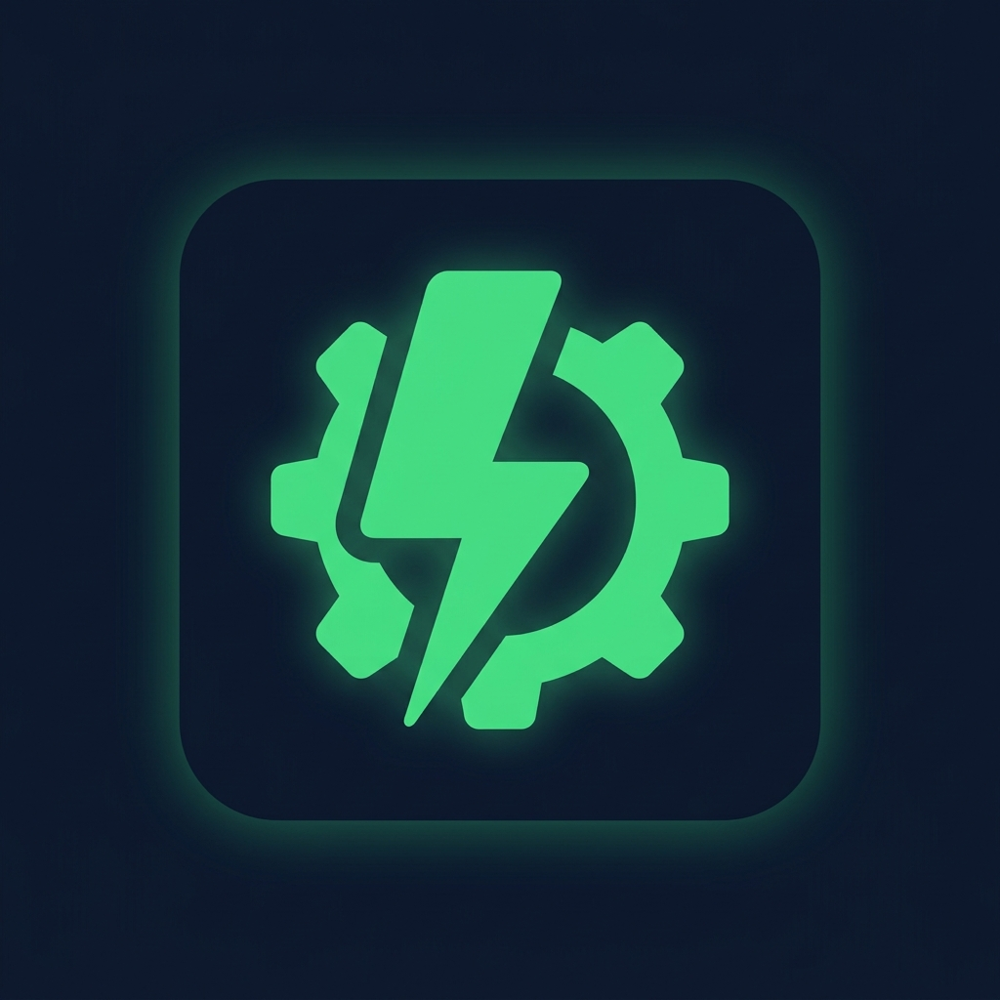

# ⚡ AI Auto Agent

[English](README.md) | [中文文档](README.zh-CN.md)

<p align="center">
  
</p>

**[Antigravity](https://antigravity.dev) 的自动化 AI Agent 助手** — 失败自动重试、自动接受编辑、配额耗尽时智能切换模型。

> **让你的 Agent 全自动运行。走开，回来看到完成的代码。**

---

## ✨ 功能特性

| 功能                    | 说明                                                            |
| ----------------------- | --------------------------------------------------------------- |
| **🔄 自动重试**         | Agent 出错或达到调用上限时，自动点击 Retry / Continue           |
| **✅ 自动接受**         | 自动接受文件编辑、终端命令 (Run)、权限请求 (Allow/Always Allow) |
| **🔀 模型轮换**         | API 配额耗尽时自动切换到下一个模型 — _本扩展独有功能_           |
| **🛡 危险命令拦截**     | 阻止破坏性命令（`rm -rf`、`mkfs` 等），使用词边界匹配防止误拦   |
| **🔌 多会话 CDP**       | 同时连接所有 webview target — 支持多窗口同时工作                |
| **⚡ MutationObserver** | 事件驱动按钮检测（~100ms 延迟），替代轮询 — 零漏检              |

### 🔀 模型轮换原理

当 Agent 遇到 "配额耗尽" 或 "频率限制" 错误：

```
gemini-2.5-pro (配额用完) → claude-4-sonnet → gemini-2.5-flash → claude-4-opus → gemini-2.5-pro ...
```

1. 在 Agent 面板中检测到配额/频率限制错误
2. 自动切换到轮换列表中的下一个模型
3. 重置重试计数器
4. Agent 在新模型上无缝继续工作

---

## 🚀 安装配置

### 1. 启用调试模式（必须）

启动 Antigravity 时加上 CDP 参数：

```bash
# 快速启动（一次性）
open -a "Antigravity" --args --remote-debugging-port=9333
```

如需永久生效，添加别名：

```bash
# macOS（加到 ~/.zshrc）
alias antigravity='open -a "Antigravity" --args --remote-debugging-port=9333'

# Linux（编辑 .desktop 文件或添加别名）
alias antigravity='antigravity --remote-debugging-port=9333'

# Windows（右键快捷方式 → 属性 → 在"目标"末尾追加）
--remote-debugging-port=9333
```

> ⚠️ **注意：** 如果 Antigravity 已经在运行，必须先完全退出再重新启动。`--args` 参数只在首次启动时生效。

> **为什么用 9333 端口？** Antigravity 内置的 Browser Control 使用 9222 端口，9333 避免 `EADDRINUSE` 端口冲突。

### 2. 安装扩展

**通过 VSIX 安装：**

1. 从 [Releases](https://github.com/double12gzh/ai-auto-agent/releases) 下载 `.vsix`
2. `Ctrl+Shift+P` → `Extensions: Install from VSIX`
3. 选择文件 → 重新加载窗口

### 3. 使用方法

- **开关切换：** `Cmd+Shift+A`（macOS）/ `Ctrl+Shift+A`（Windows/Linux）
- **状态栏：** 点击 `⚡ AAA` 开关
- **仪表盘：** `Ctrl+Shift+P` → `AI Auto Agent: Show Dashboard`
- **选择轮换模型：** `Ctrl+Shift+P` → `AI Auto Agent: Select Models for Rotation`（自动从当前 IDE 面板抓取最新支持的模型供你勾选）

---

## 🛠️ 常用开发命令

如果你想从源码本地开发或者贡献代码：

```bash
# 1. 安装依赖（自动配置 pre-commit 等 Git Hooks 拦截检查代码风格）
npm install

# 2. 本地开发热编译监听（推荐开发调试用）
npm run watch

# 3. 全局执行代码风格检查与自动修复（基于 ESLint & Prettier）
npm run format
npm run lint

# 4. 运行所有单元测试
npm run test

# 5. 编译并手工打包为 .vsix 文件（发布通常依赖 GitHub Actions 自动构建）
npm run package
```

> **注意：** 项目已配置 GitHub Actions CI 流程，所有提交推送到仓库后，都会自动执行 Lint 检查、TypeScript 类型检查和单元测试。如果带有 `v*` 书签（Tag），CI 还会自动发布到插件市场与 GitHub Release 页面。

---

## ⚙️ 配置项

| 设置                                 | 默认值                    | 说明                             |
| ------------------------------------ | ------------------------- | -------------------------------- |
| `ai-auto-agent.enabled`              | `true`                    | 启用/禁用扩展                    |
| `ai-auto-agent.cdpPort`              | `9333`                    | CDP 调试端口                     |
| `ai-auto-agent.autoRetry`            | `true`                    | Agent 失败时自动重试             |
| `ai-auto-agent.autoRetryMaxAttempts` | `5`                       | 达到最大重试次数后触发模型轮换   |
| `ai-auto-agent.autoRetryDelayMs`     | `2000`                    | 重试间隔（毫秒）                 |
| `ai-auto-agent.autoAccept`           | `false`                   | 自动接受编辑和命令（需手动开启） |
| `ai-auto-agent.dangerousCommands`    | `["rm -rf", ...]`         | 永远不会自动执行的命令列表       |
| `ai-auto-agent.modelRotation`        | `true`                    | 配额耗尽时自动切换模型           |
| `ai-auto-agent.modelList`            | `["gemini-2.5-pro", ...]` | 有序的模型轮换列表               |

> 所有设置都支持热加载 — 修改后立即生效，无需重启。

---

## 🔥 多 Agent 并行运行（推荐方案）

Antigravity 的 Agent Manager 使用**单个共享 webview** — 只有当前激活的会话会渲染 DOM。后台 Agent 在遇到需要审批的操作时**会被阻塞**，因为插件无法触及未渲染的按钮。

**解决方案：复制工作区**

1. 在 Antigravity 中打开你的项目
2. 点击 **File → Duplicate Workspace**
3. 每个窗口都有自己独立的 webview 和活跃的 DOM
4. 在每个窗口中启动不同的 Agent 任务
5. 插件会在**所有窗口中同时自动点击**

```
窗口 1: Agent → "实现用户认证"        ← ✅ 自动点击中
窗口 2: Agent → "编写单元测试"        ← ✅ 自动点击中
窗口 3: Agent → "添加 API 文档"       ← ✅ 自动点击中
```

> **启动 5 个 Agent，最小化，走开。回来看到完成的代码。**

---

## 🏗 技术架构

```
extension.ts
├── cdp/
│   ├── cdpClient.ts     — 多会话 WebSocket 管理器（vscode-webview:// 目标）
│   └── domMonitor.ts    — MutationObserver 注入 + 心跳自愈
└── features/
    ├── autoAccept.ts    — 接受编辑、命令、权限
    ├── autoRetry.ts     — 重试/继续 + 最大重试次数跟踪
    └── modelRotation.ts — 配额检测 + 模型循环切换
```

### CDP 工作原理

```
Antigravity (--remote-debugging-port=9333)
│
├── /json 端点 → 发现 vscode-webview:// 目标
│
├── WebSocket 会话 1 → webview（窗口 1 的 Agent 面板）
│   └── 注入 MutationObserver → 点击按钮 → 通过 Runtime.addBinding 回传
│
├── WebSocket 会话 2 → webview（窗口 2 的 Agent 面板）
│   └── 注入 MutationObserver → 点击按钮 → 通过 Runtime.addBinding 回传
│
└── 心跳检查（10s）→ 验证会话存活，重新注入死掉的 observer
```

### 按钮检测优先级

| 优先级 | 关键词                         | 匹配                                  |
| ------ | ------------------------------ | ------------------------------------- |
| 1      | `run`                          | "Run Alt+d" ✅（不匹配 "Always run"） |
| 2      | `accept` / `接受`              | 接受按钮                              |
| 3      | `always allow`                 | 权限提示                              |
| 4      | `allow this conversation`      | 会话级权限                            |
| 5      | `allow` / `允许`               | 权限提示                              |
| 6      | `retry` / `重试` / `try again` | 重试提示                              |
| 7      | `continue` / `继续`            | Agent 调用限额恢复                    |

---

## 🔒 安全性

- **危险命令自动拦截** — 词边界匹配防止误拦
- **自动接受默认关闭**（`false`）— 需要用户手动开启
- **CDP 仅监听本地** — 端口绑定 `127.0.0.1`，不暴露到网络
- **完全开源** — 无遥测、无网络请求、无数据收集
- **纯 UI 扩展** — 只在本地运行，不涉及远程服务器

---

## 📄 许可证

MIT
